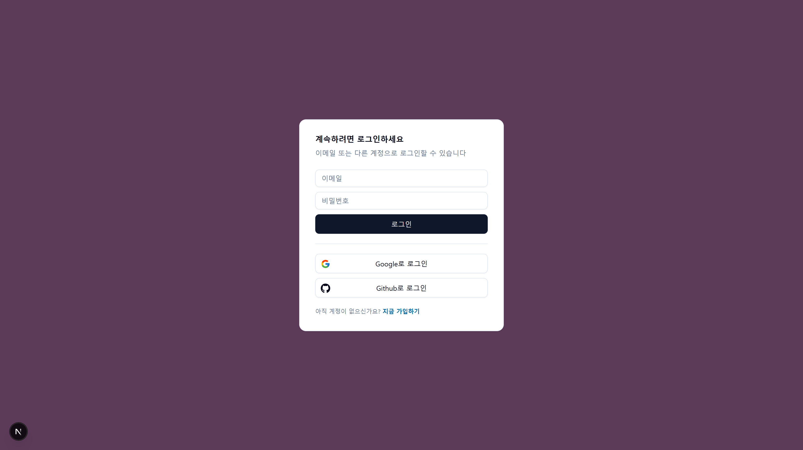
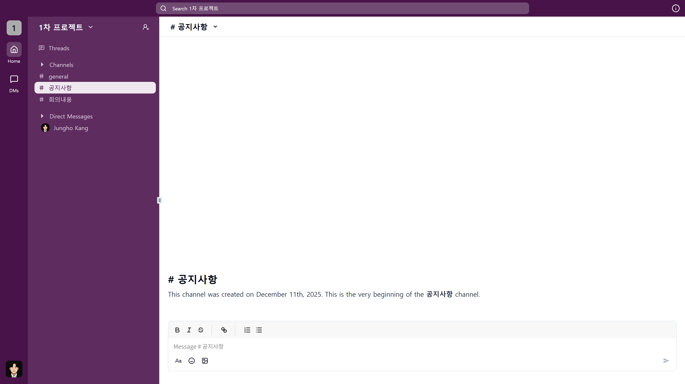
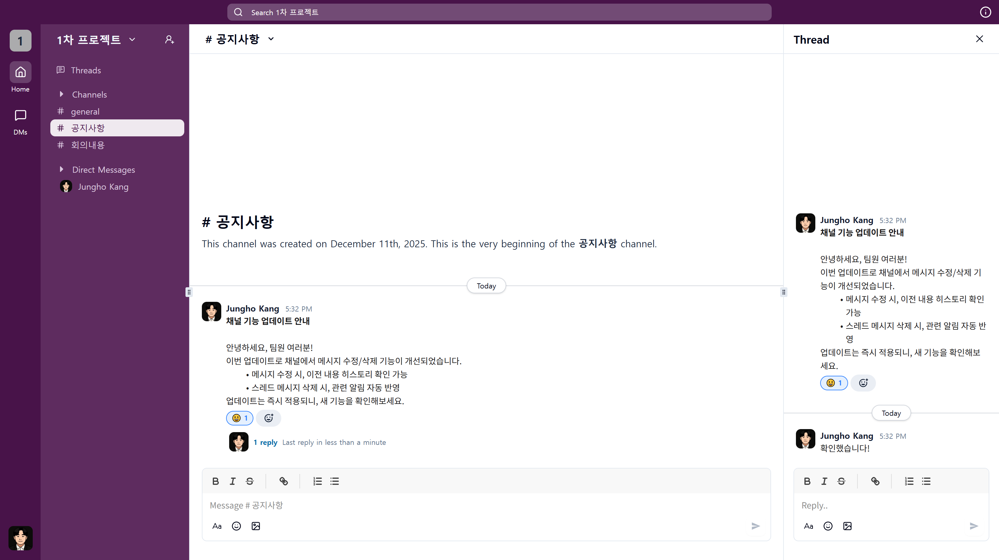

# Slack Clone

> ⚠️ 학습용 프로젝트로, 실제 Slack과 동일한 안정성을 보장하지 않습니다.

[🌐 Live Demo](https://slack-clone-ten-sage.vercel.app)

---

## 🖥️ 화면 예시

### 로그인 화면



### 워크스페이스



### 채팅 & 스레드



---

## 📌 프로젝트 소개

**Slack 클론 기반, 팀 협업과 채팅 기능 구현**

Slack의 핵심 기능을 직접 구현하며 팀 협업용 툴을 개발한 프로젝트입니다.  
Next.js App Router를 활용한 UI/UX 구조와 Convex를 통한 데이터 처리 및 인증 흐름을 경험했습니다.

---

## ✨ 주요 기능

- **워크스페이스**: 생성, 참여, 초대 코드/링크 공유
- **채팅**: 메시지 작성, 스레드, 수정/삭제, 파일 업로드, 이모지/리치 텍스트 지원
- **채널 & 멤버 관리**: 채널 생성/수정/삭제, 멤버 관리

---

## 🛠 기술 스택

- **Frontend**: Next.js 16, React 19, Tailwind CSS 4, shadcn/ui, Jotai
- **Backend / Infra**: Convex, @convex-dev/auth
- **Development**: Bun, ESLint

---

## 💡 기술적 포인트

- Next.js Middleware와 Convex Auth 연동 경험
- Slack 구조 직접 모델링 및 Shadcn/UI 적용으로 Slack과 유사한 UI 구성
- Bun 패키지 호환 문제 조정 경험

---

## 🚀 설치 및 실행

```bash
# 저장소 클론
git clone https://github.com/jungho-Kang/slack-clone.git .
cd slack-clone

# 패키지 설치 (Bun 사용)
bun install

# 개발 서버 실행
bun run dev

# convex 개발 서버 실행
bunx convex dev # 로컬에서 데이터베이스와 함수 실행
```
